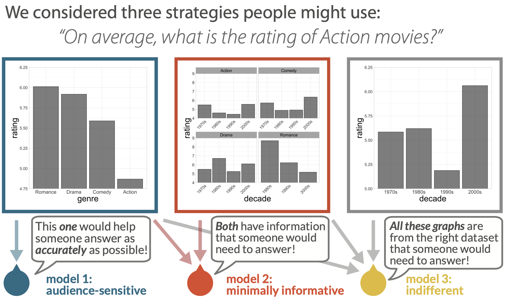
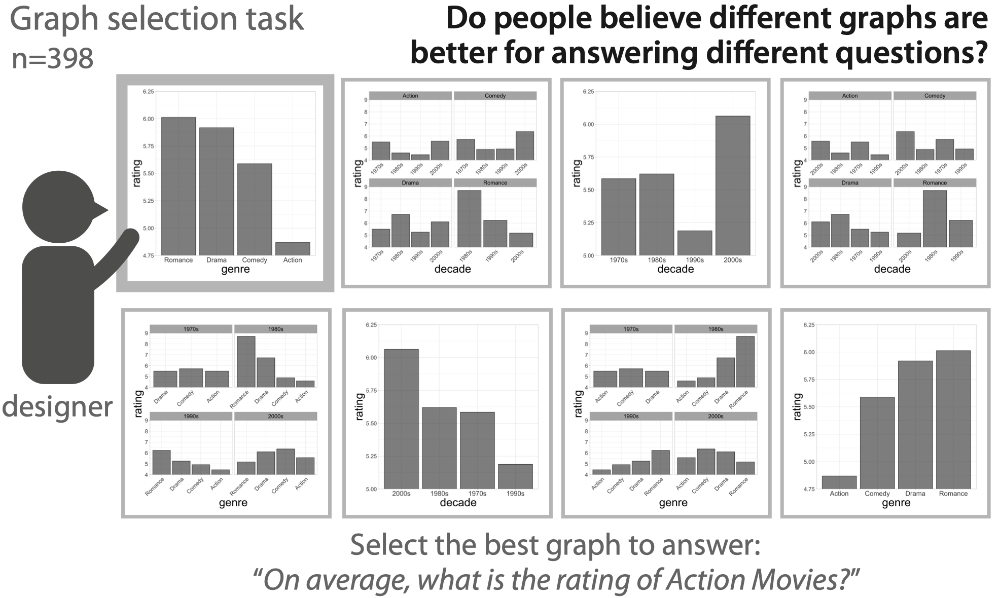
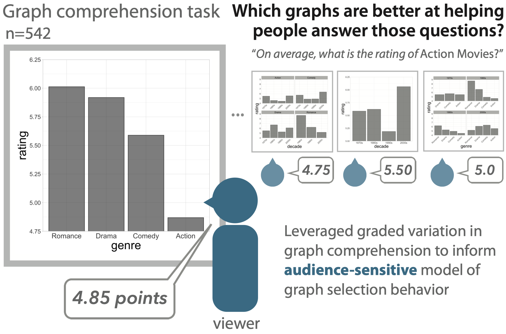
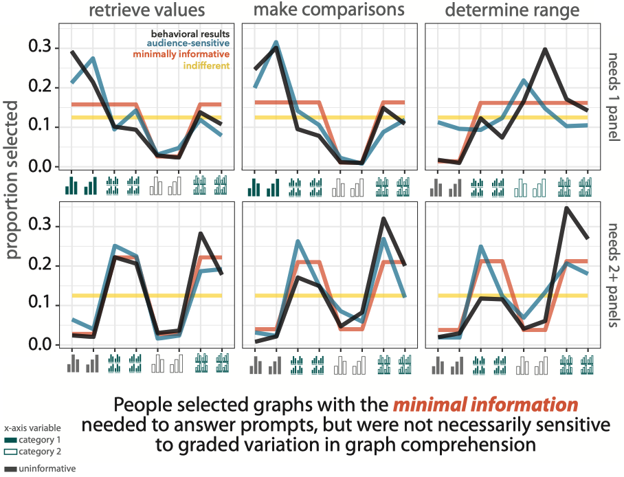
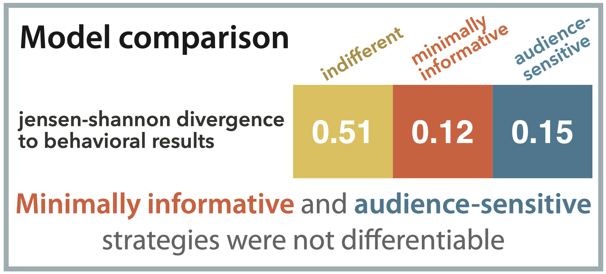

# How do communicative goals guide which data visualizations people think are effective?
#### Holly Huey*, Lauren A. Oey*, Hannah S. Lloyd, and Judith E. Fan

Data visualizations are powerful tools for communicating quantitative information. 
While prior work has focused on how experts design informative graphs, little is known about the intuitions non-experts have about what makes a graph effective for communicating a specific message. 
Here we explore how people select graphs that make it easy for others to understand key patterns in data.

### Stimuli & Hypotheses

To systematically measure people’s preferences for different data visualizations depending on their goal, we developed a graph selection task to measure the range of preferences that people have when trying to communicate specific information to viewers in graph form.

We selected 8 popular datasets from the MASS package (Venables & Ripley, 2002). 
From each dataset, we generated 8 bar graphs representing means by manipulating three commonly used parameters: 
(1) grouping in one or multiple separate panels (i.e., faceting), 
(2) x-axis variable, and 
(3) organization by ascending ordering of numerical x-axis variables or by alphabetical ordering. 

  </img>

<b>Hypothesis 1: Audience-sensitivity</b> 
If a person’s judgments about data visualization design are sensitive to what na¨ıve viewers may need to answer specific questions, we predicted that people would have strong preferences for data visualizations based on a presented question that they are tasked to help someone else answer (<i>left</i>). 
More concretely, we hypothesized that they would prioritize two goals: 
(1) to identify graphs containing the minimal information necessary to answer a presented question (e.g., although a graph may be generated from an appropriate dataset, it may not contain all the information necessary to answer a specific question about it if a specific variable is not plotted); and 
(2) among those “informative” graphs, to selectively prioritize those that would help viewers quickly and accurately interpret them.

<b>Hypothesis 2: Minimal informativity to audiences</b> 
On the other hand, if people are not sensitive to the degree of cognitive effort required by a viewer to comprehend a graph, but instead only consider whether a graph contains the minimum information needed by na¨ıve viewers to answer specific questions about a graph (first goal of Hypothesis 1), we predicted that people would largely ignore “uninformative” graphs that omit relevant variables but would have uniform preferences among the remaining “informative” graphs (<i>middle and left</i>).

<b>Hypothesis 3: Indifference to audiences</b> 
However, if people’s judgments are indifferent to any communicative goals so long as a graph is generated from an appropriate dataset, we predicted that they would randomly and uniformly select from all presented graphs (<i>right, middle, and left</i>).

### Graph Selection Task

  </img>

First, we conducted a graph selection task in which participants (N=398) decided which of eight graphs would be most useful for answering a particular question (e.g., “On average, how much higher are ratings of Drama movies compared to Comedy movies?”), where all graphs were generated from the same dataset but varied in how the data were arranged. 

### Graph Comprehension Task

  </img>

Next, we conducted a graph comprehension task to obtain estimates of how well a separate group of participants (N=542) could actually answer questions about those data visualizations. We then asked to what degree the graphs that best supported graph comprehension were also those that participants in the graph selection experiment were most likely to choose, and vice versa.

## Results
#### Evaluating sensitivity to different data visualization features

  </img>

Consistent with our minimally informative hypothesis, we found that participants systematically chose informative graphs that contained at least the minimal amount of information needed to answer a corresponding question prompt, relative to uninformative ones (z = 15.4, p < 0.001).

  </img>

Consistent with our minimally informative hypothesis, we found that participants systematically chose informative graphs that contained at least the minimal amount of information needed to answer a corresponding question prompt, relative to uninformative ones (z = 15.4, p < 0.001).
However, while our audience-sensitive model more closely matched participants’ selection behavior compared to an indifferent model (β = −0.06, t = −5.80, p < 0.001), we did not find significant improvement in this ability to predict selection behavior compared to a minimally informative model (β = 0.005, t = 0.51, p = 0.62). 

In sum, these results suggest that people are sensitive to different degrees of informativity when choosing between informative and uninformative graphs, but are not necessarily sensitive to more subtle difference between how different graphs plotting the same data could better support faster and accurate comprehension by viewers.

## How to navigate this repository

See `/experiments/` for our web experiment for collecting the semantic annotations. This experiment was built using JsPsych: https://www.jspsych.org/7.2/

• `/data/` contains files that practice annotations trials  
• `/js/` contains JsPsych plugins, as well as custom written plugins (e.g., `jspsych-stroke-kid-annotations.js`)  
• `/stim/` contains instructions files
